  

## 🛠️ Tech Stack

<table>
<tr>

<td align="center" width="120">
 
<b>Make.com</b>
</td>

<td align="center" width="120">
 
<b>n8n</b>
</td>

<td align="center" width="120">
 
<b>OpenAI</b>
</td>

<td align="center" width="120">
 
<b>Gemini</b>
</td>

<td align="center" width="120">
 
<b>Google Workspace</b>
</td>

<td align="center" width="120">
 
<b>JavaScript</b>
</td>

<td align="center" width="120">
 
<b>Google Sheets</b>
</td>

<td align="center" width="120">
 
<b>Git</b>
</td>

<td align="center" width="120">
 
<b>GitHub</b>
</td>

<td align="center" width="120">
 
<b>Docker</b>
</td>

</tr>
</table>

  
### AI Automation Specialist

I build practical AI-powered business automation systems that turn repetitive manual processes into structured, automated workflows.

My focus is on combining **AI, workflow automation, APIs, and business tools** to solve real-world operational problems.

---

## 🧠 What I Work On

- 🤖 AI-powered business automation
- ⚙️ Workflow automation
- 🔗 API & webhook integrations
- 🧩 LLM integrations
- 📊 Data processing & transformation
- 🎯 Lead generation systems
- 📄 Document & quotation automation
- 🔄 Business process automation
---
 

## 🐍 GitHub Contributions

  

